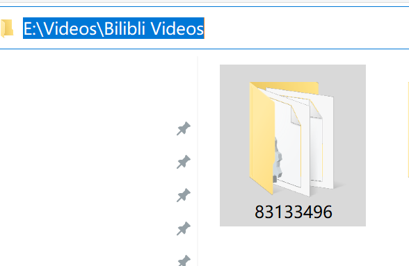
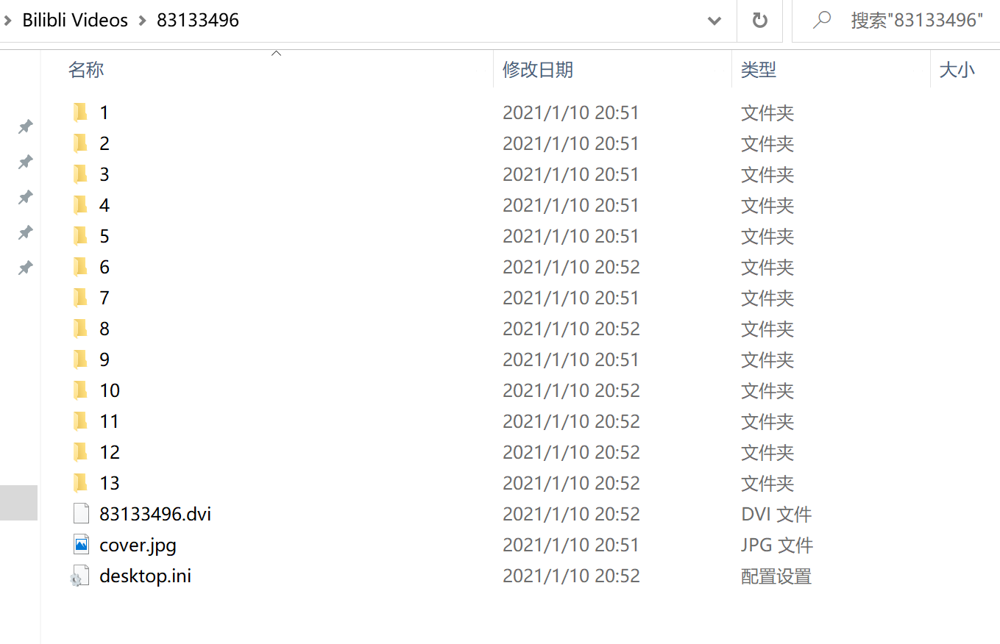
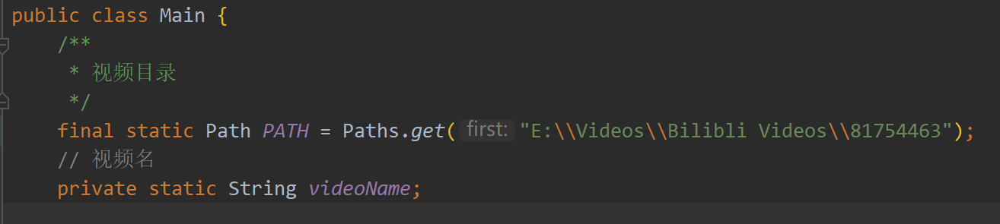
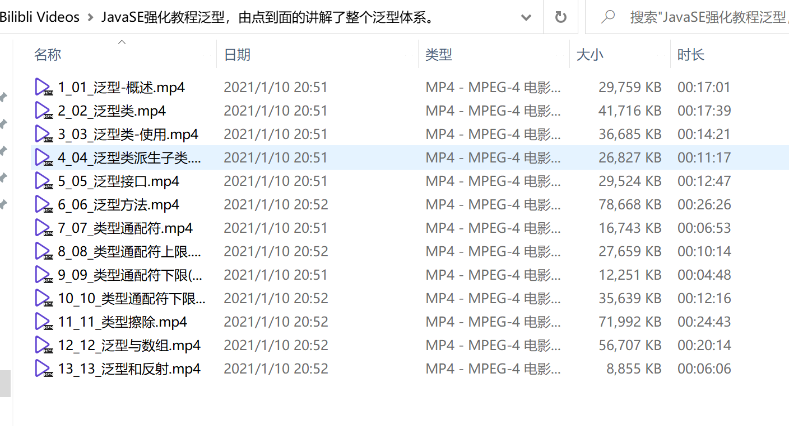

# 哔哩哔哩电脑客户端下载视频重命名 2.0

## 使用前请做好文件备份，不保证完全成功

较 master 分支的改变：

- 优化了重命名的代码，覆盖更全面，更准确；
- 重命名过程中删除多余文件，文件更简洁；
- 重构为 maven 更有利于二次开发；
- 使用 NIO 操作文件，功能更强大，效率更高；

有问题欢迎与我交流 Q：594983498

WeChat：

## 示例
1. 下载好的视频目录，以 av 号命名：

2. 内部以分批的编号命名：

3. 代码入口：Main.java

需要将视频目录定义为 PATH 常量

4. 直接执行即可

